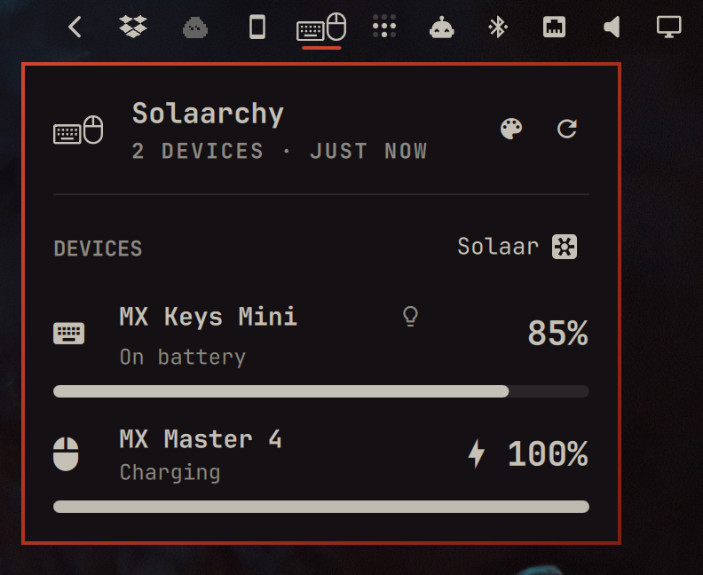
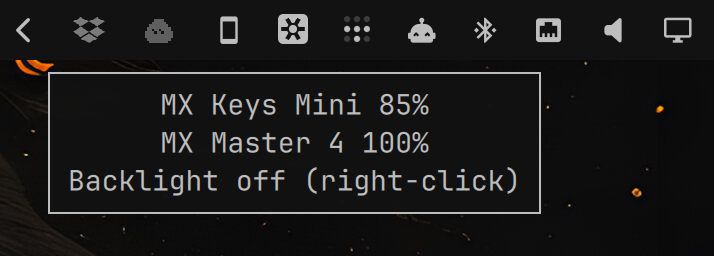
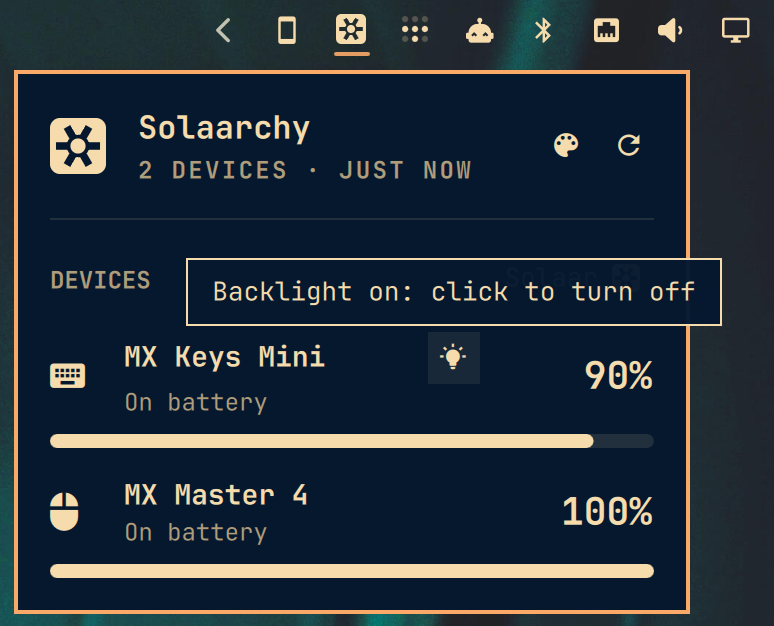
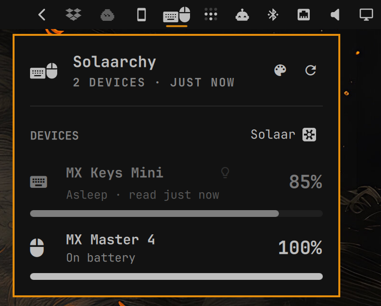
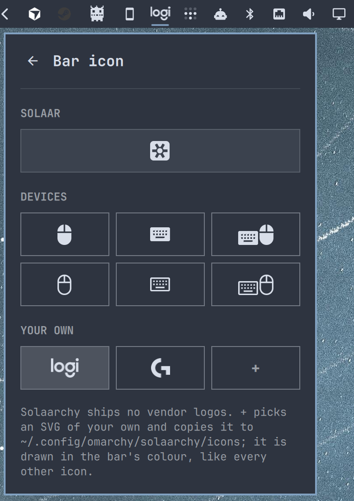

# Solaarchy

Every connected Logitech device at a glance, in the
[Omarchy](https://omarchy.org/) bar: how much battery each one has left, which
ones are awake, and the keyboard backlight — one click away, without opening an
app. Read through [Solaar](https://github.com/pwr-Solaar/Solaar).



- Battery level, charging state and a charge bar for each device
- Live updates: a device that switches off or goes to sleep shows as **Asleep**
  right away with its last reading; one that wakes, or a receiver plugged in or
  out, triggers a fresh read. No fast polling.
- One notification per discharge when a device drops below the low-battery
  threshold
- Keyboard backlight on/off: the bulb next to each keyboard's name, or
  right-click the bar icon
- The widget hides itself while no receiver is plugged in (optional)
- Bar icon picker in its own sub-panel, and a one-click way to open Solaar
- Last readings survive shell restarts

Solaarchy ships no vendor logos and is not affiliated with, or endorsed by,
Logitech or the Solaar project.

## Screenshots

<table>
  <tr>
    <td align="center" valign="top">
      <br>
      <sub>Hover the bar icon for every battery level at a glance</sub>
    </td>
    <td align="center" valign="top">
      <br>
      <sub>The bulb next to a keyboard switches its backlight</sub>
    </td>
  </tr>
  <tr>
    <td align="center" valign="top">
      <br>
      <sub>A sleeping keyboard keeps its last reading; bar icon: keyboard + mouse</sub>
    </td>
    <td align="center" valign="top">
      <br>
      <sub>Customise the bar icon: Solaar's own, a device icon, or any SVG you
      add yourself with <b>+</b></sub>
    </td>
  </tr>
</table>

The panel follows your Omarchy theme; these shots use several different ones.

## Requirements

- Omarchy with the Quattro shell
- **Solaar**, from the official Arch repositories:

  ```sh
  omarchy pkg add solaar
  ```

  It brings the Python library Solaarchy reads through and the udev rule that
  lets your user access Logitech receivers. Log out and back in (or replug the
  receiver) after installing it for the first time.

- Recommended: keep the Solaar app running in the background, so backlight
  changes are remembered and re-applied when the keyboard wakes. Add this to
  `~/.config/hypr/autostart.lua`:

  ```lua
  o.launch_on_start("solaar --window=hide")
  ```

## Install

```sh
omarchy plugin add https://github.com/C50NK4/Solaarchy.git --enable
```

## Usage

| On the bar icon | Does                               |
| --------------- | ---------------------------------- |
| Left-click      | Open or close the panel            |
| Right-click     | Toggle the keyboard backlight      |
| Middle-click    | Open Solaar                        |

In the panel:

- The **bulb** next to a keyboard's name switches its backlight.
- **Solaar** on the DEVICES line opens Solaar, for pairing, buttons, DPI and
  everything else.
- The **palette** next to Refresh opens the bar icon picker; the back arrow or
  Escape returns to the devices.

Arrow keys move between controls, Enter activates, and Escape closes.

The panel can also be opened from a script:

```sh
omarchy-shell shell summon io.github.c50nk4.solaarchy '{}'
```

## Configure

All settings are available in the Omarchy bar settings, or from the terminal:

```sh
omarchy bar set io.github.c50nk4.solaarchy icon mouse
omarchy bar set io.github.c50nk4.solaarchy lowThreshold 20
omarchy bar set io.github.c50nk4.solaarchy hideWhenDisconnected false --json
omarchy bar move io.github.c50nk4.solaarchy --section right
```

| Setting                | Default  | Meaning                                                                            |
| ---------------------- | -------- | ---------------------------------------------------------------------------------- |
| `icon`                 | `solaar` | Bar icon, see below                                                                |
| `customIcon`           | *(empty)*| File name of your own SVG, without `.svg`. Overrides `icon` while set              |
| `customIconDir`        | *(empty)*| Folder scanned for your own SVGs. Empty means `~/.config/omarchy/solaarchy/icons`  |
| `lowThreshold`         | `15`     | Battery % at or below which the icon turns urgent and a notification is sent      |
| `refreshIntervalSec`   | `300`    | Backup poll. Connection changes are picked up immediately either way               |
| `hideWhenDisconnected` | `true`   | Hide the widget while no Logitech receiver or device is connected                 |

### Bar icons

| Icons                                                              | Values                                                               |
| ------------------------------------------------------------------ | -------------------------------------------------------------------- |
| Solaar's own icon (default)                                        | `solaar`                                                             |
| Mouse, filled and outline                                          | `mouse`, `mouse-outline`                                             |
| Keyboard, filled and outline                                       | `keyboard`, `keyboard-outline`                                       |
| Keyboard + mouse, filled and outline                               | `combo`, `combo-outline`                                             |

Sources and licenses: [THIRD_PARTY.md](THIRD_PARTY.md).

### Your own bar icon

Solaarchy ships no vendor logos — no Logitech mark, no anyone else's. Those are
trademarks, and a plugin that hands them out is distributing artwork it has no
licence to, however small the icon is. Solaar itself takes the same line: it
uses the word "Logitech" to say what hardware it supports, and every icon it
ships is its own.

That leaves a real wish unserved: plenty of people are fond of their hardware
and want its mark in their own bar. So instead of shipping the artwork,
Solaarchy renders whatever SVG **you** supply.

Open the bar icon picker (the palette next to Refresh) and click **+** under
**YOUR OWN**. Pick an `.svg` file, and it is copied into
`~/.config/omarchy/solaarchy/icons/` and selected right away — no terminal, no
config file.

Every `.svg` in that folder is a tile of its own, so keep as many as you like
and switch between them in one click. Copying files in by hand works just as
well, and the folder is watched, so anything you add or remove shows up without
restarting the shell. From the terminal:

```sh
omarchy bar set io.github.c50nk4.solaarchy customIcon my-logo   # the file name, no .svg
omarchy bar set io.github.c50nk4.solaarchy customIcon ""        # back to the built-in icon
```

Notes:

- The icon takes your Omarchy theme's bar colour, exactly like every built-in
  icon, and turns urgent-red with the rest of the widget on low battery. So a
  single-colour silhouette works best: a multi-colour logo still renders, but
  as one solid shape.
- Proportions come from the file's `viewBox`, so a wide wordmark gets a wide
  slot instead of being squashed.
- What you put there is yours and stays on your machine. Using someone's
  trademark on your own desktop is your call; Solaarchy neither ships nor
  fetches it.

## Supported hardware

Developed and used daily with:

- **Bolt Receiver**
- **MX Keys Mini for Business** (battery + backlight)
- **MX Master 4** (battery)

Beyond that, anything Solaar can see:

- Bolt, Unifying, Nano, Lightspeed and 27 MHz receivers, with every device
  paired to them
- HID++ devices connected by USB cable or Bluetooth

Not supported: receivers Solaar doesn't know (some very basic Nano receivers,
such as the one sold with the M185) and Logitech devices without HID++ (plain
wired mice, most webcams and many headsets).

The backlight switch turns the backlight on or off. "On" is the first on-mode
Solaar offers for the keyboard: Automatic where the keyboard supports it,
otherwise Enabled or Manual. Brightness levels are left to the keyboard and
Solaar.

## How it works, and what it touches

Plugins run unsandboxed inside the Omarchy shell, so here is everything
Solaarchy does:

- **Reading devices:** `solaarchy-status.py` uses Solaar's Python library to
  ask each device for its battery and backlight state. It runs when the panel
  opens, after connection changes, and every `refreshIntervalSec`. It does not
  change any device setting and never writes Solaar's configuration. Reads are
  serialized with a lock in `$XDG_RUNTIME_DIR`, and every read is
  double-checked, because HID++ replies from other programs (the Solaar app
  included) can otherwise be mistaken for its own.
- **Watching connections:** `solaarchy-monitor.py` runs for as long as the
  widget is enabled. It opens the Logitech receivers' `/dev/hidraw*` nodes
  read-only and listens for connect/disconnect messages and USB hotplug
  events. It never writes to a device. The kernel stops it together with the
  shell.
- **Changing things:** only when you ask. Toggling the backlight runs
  `solaar config <device> backlight …`. Picking a bar icon runs
  `omarchy bar set … icon …`. Opening Solaar runs `uwsm-app -- solaar`.
- **Files:** last readings are saved to
  `~/.local/state/omarchy/solaarchy.json`. Settings live in
  `~/.config/omarchy/shell.json` like every bar widget's.
- **Notifications:** sent with `notify-send -a Solaarchy`.
- **Privileges:** none. No sudo, no udev rule or system service of its own;
  hardware access comes from Solaar's udev rule.

## Troubleshooting

- **"solaar library unavailable"**: Solaar isn't installed, see Requirements.
- **"could not open 046d:…: Permission denied"**: Solaar's udev rule hasn't
  applied yet. Replug the receiver or log out and back in.
- **The widget doesn't appear**: nothing Logitech is connected and
  `hideWhenDisconnected` is on. Run
  `omarchy plugin list --json | jq '.[] | select(.id == "io.github.c50nk4.solaarchy")'`
  to check that it's enabled, and `qs log -p "$OMARCHY_PATH/shell" --tail 100`
  for errors.
- **Backlight turns back on or off by itself**: the Solaar app is not
  running, or was running with a different saved setting. Start it as shown
  under Requirements.

## Update

```sh
omarchy plugin update io.github.c50nk4.solaarchy
```

## Remove

```sh
omarchy plugin remove io.github.c50nk4.solaarchy
rm -f ~/.local/state/omarchy/solaarchy.json
```

Removing the plugin stops the connection watcher with it. Solaar itself is
left installed.

To only take it off the bar and keep it installed:

```sh
omarchy plugin disable io.github.c50nk4.solaarchy
```

## License

Code: [MIT](LICENSE). Icons: see [THIRD_PARTY.md](THIRD_PARTY.md).
